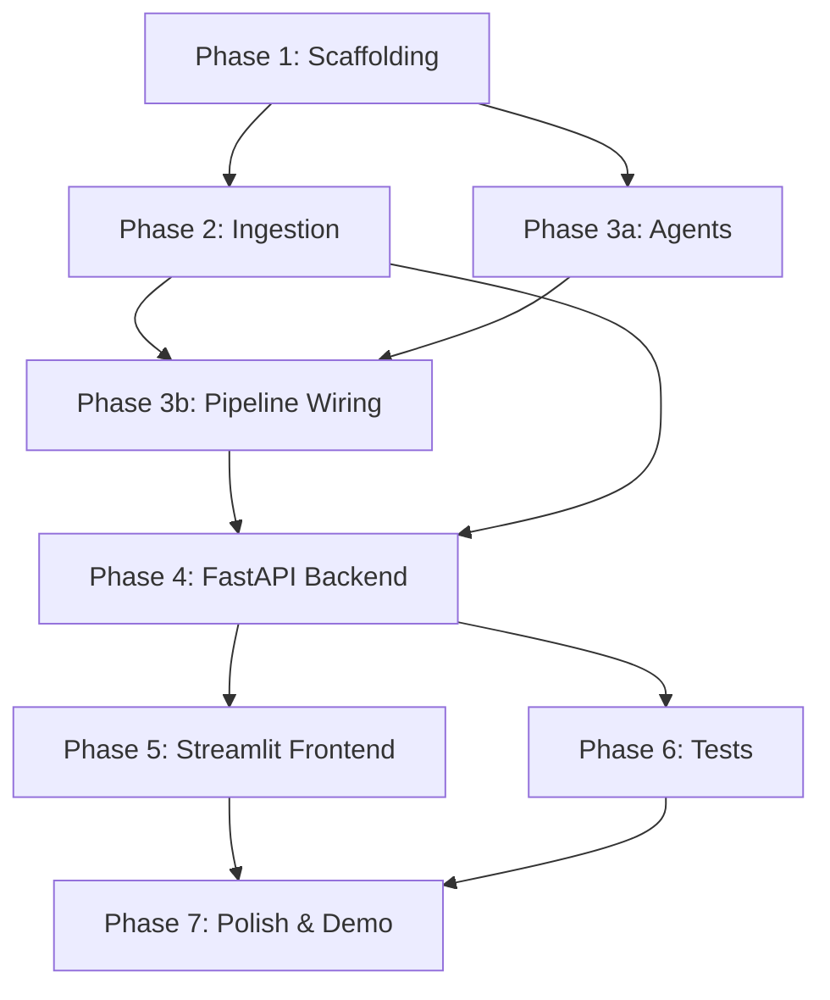

# DEPENDENCIES.md
## Phase and Feature Dependency Graph

> This document defines what must exist before what. You cannot start building a component until all its upstream dependencies are green. Follow this order; skipping it creates rework.

---

## Dependency Graph (Text)

```
[1] Environment Setup
        │
        ▼
[2] Configuration (pydantic-settings + .env)
        │
        ▼
[3] Pydantic Data Models / Schemas
        │
     ┌──┴──────────────────┐
     ▼                     ▼
[4] Ingestion Pipeline    [5] Agent Layer (parallel once schemas exist)
  [4a] Document Loader      [5a] Query Understanding Agent
  [4b] Embedder             [5b] Search Agent ──────────────── requires [4b]
  [4c] ChromaDB Collection  [5c] Answer Generator Agent
                            [5d] Source Linker Agent
        │                         │
        └──────────┬──────────────┘
                   ▼
             [6] Pipeline Wiring (LCEL chain)
                   │
                   ▼
             [7] FastAPI Routes + App
                   │
                   ▼
             [8] Streamlit Frontend
                   │
                   ▼
             [9] Tests (unit → integration)
                   │
                   ▼
             [10] Docs + Demo Prep
```

---

## Detailed Dependency Table

| Component | Depends On | Must Exist Before |
|-----------|-----------|-------------------|
| `app/core/config.py` | `.env`, `pydantic-settings` installed | Everything |
| `app/models/schemas.py` | `config.py` | All agents, routes, pipeline, tests |
| `app/ingestion/document_loader.py` | `schemas.py`, `data/sample_docs/*.md` | `embedder.py`, `scripts/ingest.py` |
| `app/ingestion/embedder.py` | `config.py`, `document_loader.py`, ChromaDB installed | `search_agent.py`, `routes.py /documents` |
| `scripts/ingest.py` | `document_loader.py`, `embedder.py` | ChromaDB is populated (required before any pipeline run) |
| `app/agents/query_understanding.py` | `schemas.py`, LiteLLM proxy reachable | `pipeline.py` |
| `app/agents/search_agent.py` | `schemas.py`, `embedder.py` (populated ChromaDB) | `pipeline.py` |
| `app/agents/answer_generator.py` | `schemas.py`, LiteLLM proxy reachable | `pipeline.py` |
| `app/agents/source_linker.py` | `schemas.py` | `pipeline.py` |
| `app/core/pipeline.py` | All 4 agents, `schemas.py` | `app/api/routes.py`, tests |
| `app/api/routes.py` | `pipeline.py`, `embedder.py`, `schemas.py` | `app/main.py`, integration tests |
| `app/main.py` | `routes.py`, `config.py` | Streamlit frontend, all API tests |
| `frontend/app.py` | Running FastAPI backend (`localhost:8000`) | Manual demo |
| `tests/test_pipeline.py` | All 4 agents, `pipeline.py`, populated ChromaDB | CI / demo |
| `tests/test_api.py` | `app/main.py` running, populated ChromaDB | CI / demo |

---

## Phase-Level Dependency Map



---

## Critical Path

The minimum path to a working demo is:

```
Config → Schemas → Ingestion → Agents → Pipeline → API → Frontend
```

All other work (tests, docs, CSS polish) is parallel or trailing. If behind schedule, protect the critical path above all else.

---

## Blocking Dependencies — Hard Rules

1. **Never build agents before schemas are finalised.** A schema change propagates to every agent, the pipeline, and the tests. Freeze `schemas.py` before Day 3.
2. **Never wire the pipeline before all 4 agents have a working `run()`.** The LCEL chain will silently fail if any agent raises mid-chain.
3. **Never build the frontend before the API is smoke-tested.** The Streamlit app depends on the exact shape of `QueryResponse` JSON.
4. **Never write integration tests before the FastAPI app is running.** `TestClient` requires the app to import cleanly.
5. **Always run ingestion before any test or pipeline invocation.** An empty ChromaDB will cause the Search Agent to return zero chunks and the Answer Generator to produce "I don't have enough information."

---

## Dependency Verification Commands

Run these in order to confirm each layer is ready before proceeding to the next:

```bash
# Phase 1 gate — config loads
python -c "from app.core.config import get_settings; print(get_settings())"

# Phase 2 gate — ingestion completes
python scripts/ingest.py

# Phase 2 gate — ChromaDB has data
python -c "from app.ingestion.embedder import get_collection_count; print(get_collection_count())"

# Phase 3 gate — pipeline runs end-to-end
python -c "from app.core.pipeline import run_pipeline; r = run_pipeline('What is the leave policy?'); print(r.intent, r.has_answer)"

# Phase 4 gate — API is up
curl http://localhost:8000/health

# Phase 6 gate — all tests pass
pytest tests/ -v --tb=short
```
